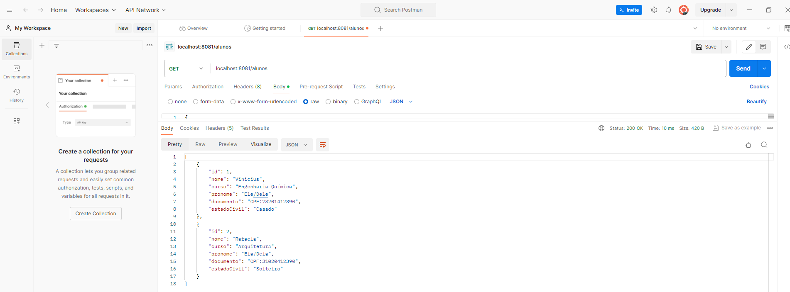
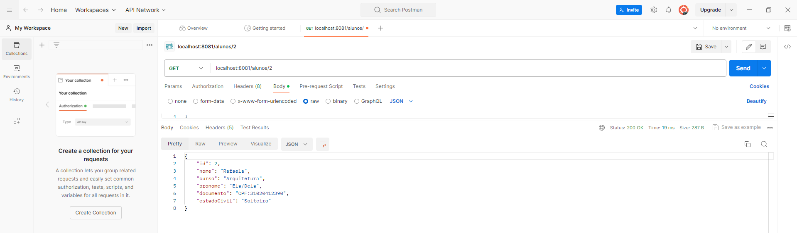
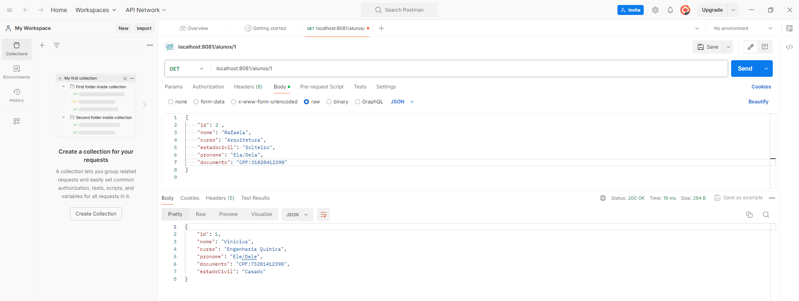
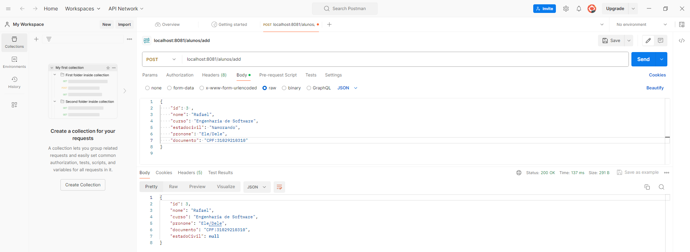

# AC1_ARQUITETURA_WEB

## Descrição

API rodando via PostMan, exercícios da aula 5

## Organização de pastas

## Método GET

### Requisição geral:

### Requisição por Id:

## Método POST:

## Publicação: https://github.com/Vini2405/AC1_ARQUITETURA_WEB

## Data de Publicação: 04/04/2024
