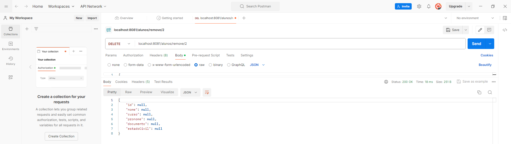

# AC1_ARQUITETURA_WEB

## Descrição
API rodando com POSTMAN, exercícios das aulas 3 e 4

## Organização de pastas

## Método GET

### Requisição geral:

### Requisição por Id:

## Método POST:

## Publicação: https://github.com/Vini2405/AC1_ARQUITETURA_WEB
## Data de Publicação: 04/04/2024
